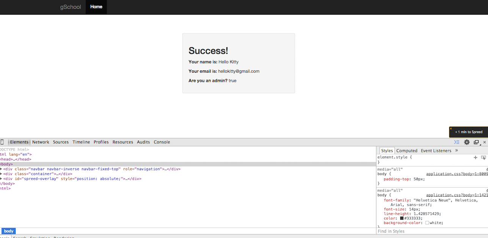

# Make yourselves an admin user!

Using _only_ the chrome web inspector, take your knowledge of how HTML inputs and
Rails params work, and craft a request that can make users admin users.

You'll know you are done when it says that you are an admin user, like so:

        <label for="user_email">Email</label>
        <input class="form-control" id="user_email" name="user[email]" type="email">
      

#I added the following to complete this assessment: 

        <label for="user_admin">Admin User</label>
        <input class="form-control" id="user_admin" name="user[admin]" type="boolean">
      

